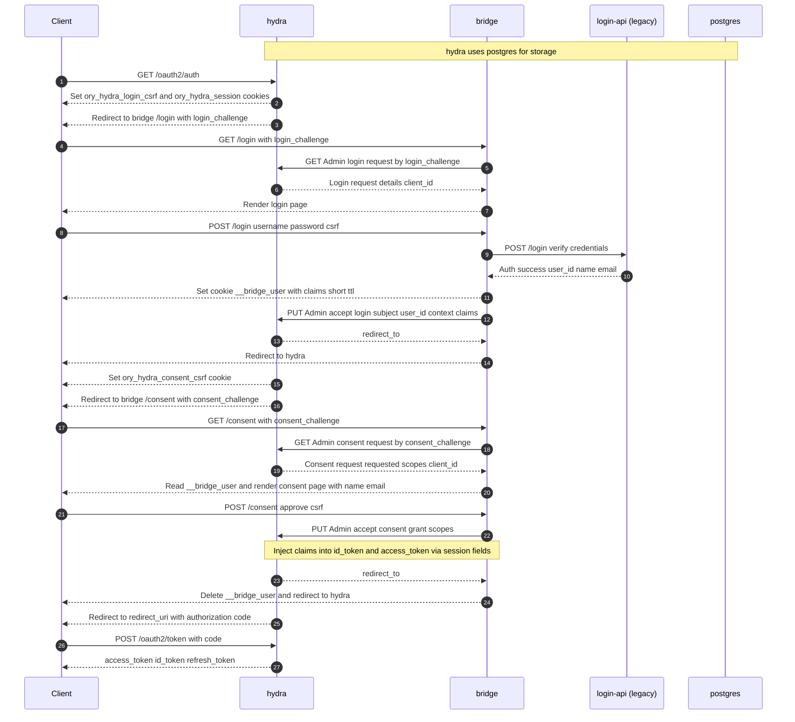

# hydra-bridge

[](https://go.dev/)
[](LICENSE)

A GitHub Hydra Brid repository for bootstrapping a new OAuth2.

## MVP A architecture

* Hydra: OAuth2/OIDC + tokens
* Bridge: Login UI + Consent UI + Hydra Admin calls
* Plugins: authenticate users (no UI)
    * Internal plugin calls your existing login API
    * Later: oidc plugin does redirect/callback (still no UI except a “Continue with …” button rendered by Bridge)

## Features

* Flow (MVP)
* Client hits Hydra /oauth2/auth
* Hydra redirects to Bridge /login?login_challenge=...
* Bridge renders login page
* User submits username/password to Bridge POST /login
* Bridge calls internal plugin → plugin calls your Login API
* Bridge calls Hydra Admin accept login with subject = your_user_id
* Hydra redirects to Bridge /consent?consent_challenge=...
* Bridge renders consent page
* User approves → Bridge calls Hydra Admin accept consent
* Hydra returns code → client exchanges at /oauth2/token

## Flow diagram



## Run it

```bash
docker compose up -d

#retart app 
docker compose restart bridge
```

Create a client (example):

```bash
curl -sS -i -X POST http://localhost:4445/clients \
  -H "Content-Type: application/json" \
  -d '{
    "client_id": "demo-client",
    "client_secret": "demo-secret",
    "grant_types": ["authorization_code","refresh_token"],
    "response_types": ["code"],
    "scope": "openid profile email offline_access",
    "redirect_uris": ["http://localhost:8091/success"],
    "token_endpoint_auth_method": "client_secret_basic"
  }'


```

Verify the client exists

```bash
curl -sS -i http://localhost:4445/clients/demo-client

```

Demo login credentials (from mock API):

```bash
curl -X POST http://localhost:8090/login \  -H "Content-Type: application/json" \
  -d '{"username":"hai","password":"123"}'
```

## Browser Flow

* Access UI http://localhost:8091
* Click Login (The browser will redirect to SSO)
* Then login with UI

```bash
username: hai
password: 123
```

* Click allow consent
* The browser will redirect to a client http://localhost:8091, We will get authorization code. To exchange token:

```bash
curl -X POST http://localhost:4444/oauth2/token \
  -H "Content-Type: application/x-www-form-urlencoded" \
  -u demo-client:demo-secret \
  -d "grant_type=authorization_code" \
  -d "code=REPLACE_WITH_CODE" \
  -d "redirect_uri=http://localhost:5555/callback"

```

* Introspect token

```bash
curl -sS -X POST http://localhost:4445/oauth2/introspect \
  -u demo-client:demo-secret \
  -H "Content-Type: application/x-www-form-urlencoded" \
  -d "token=REPLACE_WITH_ACCESS_TOKEN" | jq

```
