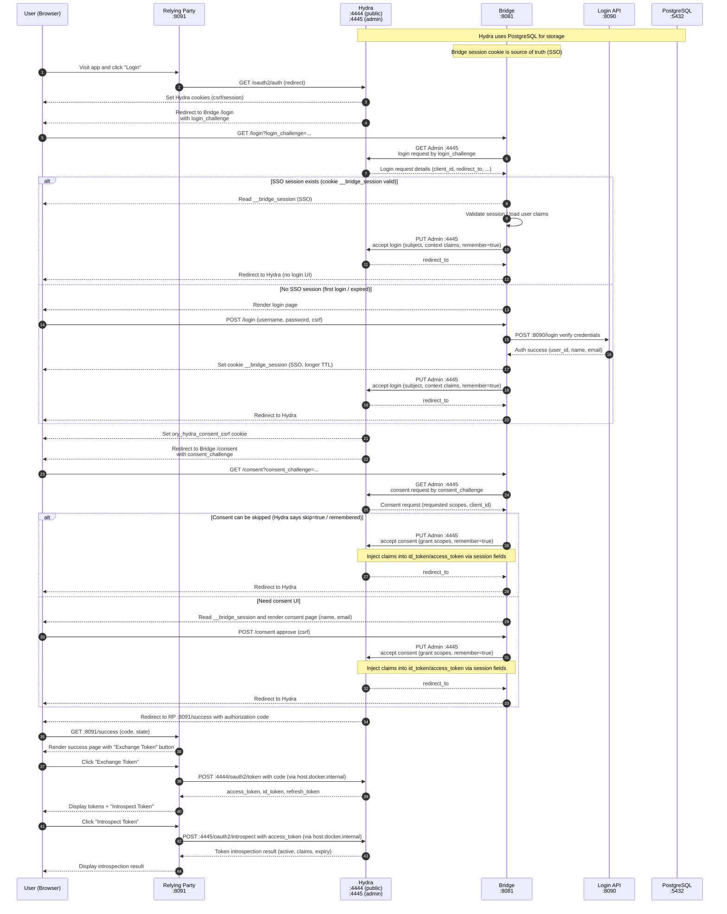

# Hydra + Bridge SSO (MVP)

[](https://go.dev/)
[](LICENSE)

This project demonstrates an **OAuth2 / OpenID Connect architecture** using **Ory Hydra** with a custom **Bridge**
acting as the **SSO Login & Consent application**.

The **Bridge session is the source of truth for authentication (SSO)**.  
Hydra is used strictly for OAuth2/OIDC orchestration and token issuance.

---

## Architecture Overview

### Components

#### Hydra

- OAuth2 / OpenID Connect server
- Issues:
    - Authorization codes
    - Access tokens
    - ID tokens
    - Refresh tokens
- Manages login & consent challenges
- Stores state in **PostgreSQL**
- **Does NOT authenticate users**

#### Bridge (SSO Login & Consent App)

- Owns **user authentication session (SSO cookie)**
- Renders:
    - Login UI
    - Consent UI
- Calls **Hydra Admin API** to:
    - Accept / reject login
    - Accept / reject consent
    - Inject claims into tokens
- Acts as the **Identity Provider façade** for Hydra

> Bridge session cookie is the **source of truth** for SSO  
> Hydra “remember” cookies are only an optimization

#### Plugins (Authentication Providers)

- No UI
- Authenticate users via:
    - Internal username/password API
    - (Later) external IdPs (OIDC, SAML, etc.)
- Return **user identity + claims** to Bridge

#### Login API (Existing System)

- Verifies credentials
- Returns user data:
    - user_id
    - name
    - email
    - roles / claims

---

## Key Principles

- **Bridge owns SSO**
    - Maintains `__bridge_session` cookie
    - Decides whether user is authenticated
- **Hydra owns OAuth2/OIDC**
    - Never sees passwords
    - Never manages user sessions
- **Second login = no UI**
    - If Bridge session exists, login is auto-approved

---

## Features (MVP)

- OAuth2 Authorization Code Flow
- OpenID Connect (ID Token)
- Consent screen (scope approval)
- First-party SSO via Bridge session cookie
- Token introspection (Hydra Admin API)
- Pluggable authentication backends

---

## Flow (MVP with SSO)



## Run it

```bash
docker compose up -d
```

### Create a client (example):

```bash
curl -sS -i -X POST http://localhost:4445/clients \
  -H "Content-Type: application/json" \
  -d '{
    "client_id": "demo-client",
    "client_secret": "demo-secret",
    "grant_types": ["authorization_code","refresh_token"],
    "response_types": ["code"],
    "scope": "openid profile email offline_access",
    "redirect_uris": ["http://localhost:8091/success"],
    "token_endpoint_auth_method": "client_secret_basic"
  }'


```

Verify the client exists

```bash
curl -sS -i http://localhost:4445/clients/demo-client

```

Demo login credentials (from mock API):

```bash
curl -X POST http://localhost:8090/login \  -H "Content-Type: application/json" \
  -d '{"username":"hai","password":"123"}'
```

### Create a Public client (You need to use PKCE, which is the secure way for public clients):

```bash
curl -sS -i -X POST http://localhost:4445/clients \
  -H "Content-Type: application/json" \
  -d '{
    "client_id": "demo-client-public",
    "client_secret": "",
    "grant_types": ["authorization_code","refresh_token"],
    "response_types": ["code"],
    "scope": "openid profile email offline_access",
    "redirect_uris": ["http://localhost:8092/success"],
    "token_endpoint_auth_method": "none"
  }'
```

Verify the client exists

```bash
curl -sS -i http://localhost:4445/clients/demo-client-public
```

## Browser Flow

* Access UI http://localhost:8091 or http://localhost:8091 for a public client
* Click Login (The browser will redirect to SSO)
* Then login with UI

```bash
username: hai
password: 123
```

* Click allow consent
* The browser will redirect to a client http://localhost:8091, We will get authorization code. To exchange token:

```bash
curl -X POST http://localhost:4444/oauth2/token \
  -H "Content-Type: application/x-www-form-urlencoded" \
  -u demo-client:demo-secret \
  -d "grant_type=authorization_code" \
  -d "code=REPLACE_WITH_CODE" \
  -d "redirect_uri=http://localhost:8091/success"

```

* Introspect token

```bash
curl -sS -X POST http://localhost:4445/oauth2/introspect \
  -u demo-client:demo-secret \
  -H "Content-Type: application/x-www-form-urlencoded" \
  -d "token=REPLACE_WITH_ACCESS_TOKEN" | jq

```

## Development

### Restart each app

```bash
docker compose restart bridge
docker compose restart relying-party-confidential
docker compose restart relying-party-public
```